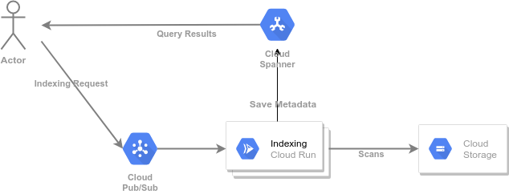

# Getting Started with GCP and C++

> :warning: This is a work-in-progress, we are writing down the guide in small steps, please do not rely on it until completed.

## Motivation

A typical use of C++ in Google Cloud is to perform parallel computations or data analysis. Once completed, the results of this analysis are stored in some kind of database.
In this guide with will build such an application, and deploy it to [Cloud Run], a managed platform to deploy containerized applications.

[Cloud Run]: https://cloud.google.com/run
[Cloud Storage]: https://cloud.google.com/storage
[Cloud Cloud SDK]: https://cloud.google.com/sdk
[GCS]: https://cloud.google.com/storage
[Cloud Spanner]: https://cloud.google.com/spanner
[Container Registry]: https://cloud.google.com/container-registry
[Pricing Calculator]: https://cloud.google.com/products/calculator
[cloud-run-quickstarts]: https://cloud.google.com/run/docs/quickstarts
[gcp-quickstarts]: https://cloud.google.com/resource-manager/docs/creating-managing-projects
[buildpacks]: https://buildpacks.io
[docker]: https://docker.com/
[docker-install]: https://store.docker.com/search?type=edition&offering=community
[sudoless docker]: https://docs.docker.com/engine/install/linux-postinstall/
[pack-install]: https://buildpacks.io/docs/install-pack/

## Overview

Google Cloud Storage (GCS) buckets can contain thousands, millions, and even billions of objects.
GCS can quickly find an object given its name, or list objects with names in a given range, but some applications need more advance lookups. For example, one may be interested in finding all the objects within a certain size, or with a given object type.

In this guide, we will create and deploy an application to scan all the objects in a bucket, and store the full metadata information of each object in a [Cloud Spanner] instance.
Once the information is in a Cloud Spanner table, one can use normal SQL statements to search for objects.

The basic structure of this application is shown below. We will create a *deployment* that *scans* the object metadata in Cloud Storage. To schedule work for this deployment we will use Cloud Pub/Sub as a *job queue*.  Initially the user posts an indexing request to Cloud Pub/Sub, asking to index all the objects with a given "prefix" (often thought of a folder) in a GCS bucket. If a request fails or times out, Cloud Pub/Sub will automatically resend it to a new instance.

If the work can be broken down by breaking the folder into smaller subfolders the indexing job will do so. It will simply post the request to index the subfolder to itself (though it may be handled by a different instance as the job scales up).  As the number of these requests grows, Cloud Run will automatically scale up the indexing deployment. We do not need to worry about scaling up the job, or scaling it down at the end.  In fact, Cloud Run can "scale down to zero", so we do not even need to worry about shutting it down.



## Prerequisites

This example assumes that you have an existing GCP (Google Cloud Platform) project.
The project must have billing enabled, as some of the services used in this example require it. If needed, consult:
* the [GCP quickstarts][gcp-quickstarts] to setup a GCP project
* the [cloud run quickstarts][cloud-run-quickstarts] to setup Cloud Run in your
  project

Verify the [docker tool][docker] is functional on your workstation:

```sh
docker run hello-world
# Output: Hello from Docker! and then some more informational messages.
```

If needed, use the [online instructions][docker-install] to download and install
this tool. This guide assumes that you have configured [sudoless docker]. If
you do not want to enable sudoless docker, replace all `docker` commands below with `sudo docker`.

Verify the [pack tool][pack-install] is functional on your workstation. These
instructions were tested with v0.20.0, although they should work with newer
versions. Some commands may not work with older versions.

```sh
pack version
# Output: a version number, e.g., 0.20.0+git-66a4f32.build-2668
```

Throughout the example we will use `GOOGLE_CLOUD_PROJECT` as an environment variable containing the name of the project.

> :warning: this guide uses Cloud Spanner, this service is billed by the hour **even if you stop using it**.
> The charges can reaches the **hundreds** or **thousands** of dollars per month if you configure a large Cloud Spanner instance. Consult the [Pricing Calculator] for details.
> Please remember to delete any Cloud Spanner resources once you no longer need them.

### Configure the Google Cloud CLI to use your project

We will issue a number of commands using the [Google Cloud SDK], a command-line tool to interact with Google Cloud services.  Adding the `--project=${GOOGLE_CLOUD_PROJECT}` to each invocation of this tool quickly becomes tedious, so we start by configuring the default project:

```sh
gcloud config set project ${GOOGLE_CLOUD_PROJECT}
# Output: Updated property [core/project].
```

### Make sure the necessary services are enabled

Some services are not enabled by default when you create a Google Cloud Project, so we start by enabling all the services we will need.

```sh
gcloud services enable run.googleapis.com
gcloud services enable cloudbuild.googleapis.com
gcloud services enable containerregistry.googleapis.com
gcloud services enable container.googleapis.com
gcloud services enable pubsub.googleapis.com
gcloud services enable spanner.googleapis.com
# Output: nothing if the services are already enabled.
# for services that are not enabled something like this
#  Operation "operations/...." finished successfully.
```

### Get the code for these examples in your workstation

So far, we have not created any C++ code. It is time to compile and deploy our application, as we will need the name and URL of the deployment to wire the remaining resources. First obtain the code:

```sh
git clone https://github.com/GoogleCloudPlatform/cpp-samples
# Output: Cloning into 'cpp-samples'...
#   additional informational messages
```

### Build Docker images for the sample programs

As mentioned above, we will use buildpacks and the `pack` tool to compile this code. Change your working directory to the code location:

```sh
cd cpp-samples/getting-started
# Output: none
```

Compile the code into a Docker image using the pack tool. This will download and compile all the necessary dependencies, and build them in an isolated environment. This step can take several minutes, maybe up to an hour, depending on the capabilities of your workstation. The dependencies are cached for future builds, so future builds will be faster.  You can continue with other steps while this build runs in a separate window.

```sh
pack build \
    --builder gcr.io/buildpacks/builder:latest \
    "gcr.io/${GOOGLE_CLOUD_PROJECT}/getting-started-cpp/index-gcs-prefix"
# Output: a large number of informational messages
#   ... followed by informational messages from the package manager ...
#   ... followed by informational messages from the build system ...
# Successfully built image gcr.io/${GOOGLE_CLOUD_PROJECT}/getting-started-cpp/index-gcs-prefix
```

> You can use [Container Registry] as a shared cache for buildpacks, both between workstations and for your CI systems. To learn more about this, consult the buildpack documentation for [cache images](https://buildpacks.io/docs/app-developer-guide/using-cache-image/).

### Create a Cloud Spanner Instance to host your data

As mentioned above, this guide uses [Cloud Spanner] to store the data. We create the smallest possible instance. If needed we will scale up the instance, but this is economical and enough for running small jobs.

```sh
gcloud beta spanner instances create getting-started-cpp \
    --config=regional-us-central1 \
    --processing-units=100 \
    --description="Getting Started with C++"
# Output: Creating instance...done.
```

### Create the Cloud Spanner Database and Table for your data

A Cloud Spanner instance is just the allocation of compute resources for your databases. Think of them as a virtual set of database servers dedicated to your databases. Initially these servers have no databases or tables associated with them, We need to create a database and table that will host the data for this demo:

```sh
gcloud spanner databases create gcs-index \
    --ddl-file=gcs_objects.sql \
    --instance=getting-started-cpp
# Output: Creating database...done.
```

### Create a Cloud Pub/Sub Topic for Indexing Requests

Publishers send messages to Cloud Pub/Sub using a **topic**, these are named, persistent resources. We need to create one to configure the application.

```sh
gcloud pubsub topics create gcs-indexing-requests
# Output: Created topic [projects/..../topics/gcs-indexing-requests].
```

### Configure IAM permissions

#### Capture the project number

```sh
PROJECT_NUMBER=$(gcloud projects list \
    --filter="project_id=${GOOGLE_CLOUD_PROJECT}" \
    --format="value(project_number)" \
    --limit=1)
# Output: none
```

#### Grant Cloud Pub/Sub permissions to use service accounts in your project

```sh
gcloud projects add-iam-policy-binding "${GOOGLE_CLOUD_PROJECT}" \
    --member=serviceAccount:service-${PROJECT_NUMBER}@gcp-sa-pubsub.iam.gserviceaccount.com \
    --role=roles/iam.serviceAccountTokenCreator
# Output: Updated IAM policy for project [${GOOGLE_CLOUD_PROJECT}].
#    bindings:
#    ... full list of bindings for your project's IAM policy ...
```

### Push the Docker images to Google Container Registry

> :warning: To continue after this point, you must wait until the `pack build` command has completed.

You need to make the Docker image created by `pack` available to Cloud Run, in this guide we will use [Container Registry] (GCR) to host the images. If you have never used Container Registry before you may need to configure docker to work with it.

```sh
gcloud auth configure-docker
# Output: Adding credentials for all GCR repositories.
#   Docker configuration file updated.
```

Then use the `docker` tool to push the image to GCR.

```sh
docker push "gcr.io/${GOOGLE_CLOUD_PROJECT}/getting-started-cpp/index-gcs-prefix:latest"
# Output: The push refers to repository [gcr.io/${GOOGLE_CLOUD_PROJECT}/getting-started-cpp/index-gcs-prefix]
#   ... progress information ...
# latest: digest: sha256:<long hex sha> size: <number>
```

### Deploy the Programs to Cloud Run

Once the image is uploaded, we can create a Cloud Run deployment to run it.  This starts up an instance of the job. Cloud Run will scale up this needed, and scale down to zero if it is idle for a while:

```sh
gcloud run deploy index-gcs-prefix \
    --image="gcr.io/${GOOGLE_CLOUD_PROJECT}/getting-started-cpp/index-gcs-prefix:latest" \
    --set-env-vars="SPANNER_INSTANCE=getting-started-cpp,SPANNER_DATABASE=gcs-index,TOPIC_ID=gcs-indexing-requests,GOOGLE_CLOUD_PROJECT=${GOOGLE_CLOUD_PROJECT}" \
    --region="us-central1" \
    --platform="managed" \
    --no-allow-unauthenticated
# Output: Deploying container to Cloud Run service [index-gcs-prefix] in project [....] region [us-central1]
#     Service [gcs-indexing-worker] revision [index-gcs-prefix-00001-yeg] has been deployed and is serving 100 percent of traffic.
#     Service URL: https://index-gcs-prefix-...run.app
```

### Capture the Service URL

We need the URL of this deployment to finish the Cloud Pub/Sub configuration:

```sh
URL="$(gcloud run services describe index-gcs-prefix \
    --region="us-central1" --format="value(status.url)")"
# Output: none
```

### Create the Cloud Pub/Sub push subscription

Create a push subscription. This sends Cloud Pub/Sub messages as HTTP requests to the Cloud Run deployment. We use the previously created service account to make the HTTP request, and allow up to 10 minutes for the request to complete before Cloud Pub/Sub retries on a different instance.

```sh
gcloud pubsub subscriptions create indexing-requests-cloud-run-push \
    --topic="gcs-indexing-requests" \
    --push-endpoint="${URL}" \
    --push-auth-service-account="${PROJECT_NUMBER}-compute@developer.gserviceaccount.com" \
    --ack-deadline=600
# Output: Created subscription [projects/${GOOGLE_CLOUD_PROJECT}/subscriptions/indexing-requests-cloud-run-push].
```

### Use `gcloud` to send an indexing request

This will request indexing some public data. The prefix contains less than 100 objects:

```sh
gcloud pubsub topics publish gcs-indexing-requests \
    --attribute=bucket=gcp-public-data-landsat,prefix=LC08/01/006/001
# Output: messageIds:
#     - '....'
```

### Querying the data

The data should start appearing in the Cloud Spanner database. We can use the `gcloud` tool to query this data.

```sh
gcloud spanner databases execute-sql gcs-index --instance=getting-started-cpp \
    --sql="select * from gcs_objects where name like '%.txt' order by size desc limit 10"
# Output: metadata for the 10 largest objects with names finishing in `.txt`
```

## Scaling Up

> :warning: the following steps will incur significant billing costs. Use the [Pricing Calculator] to estimate the costs. If you are uncertain as to these costs, skip to the [Cleanup Section](#cleanup).

To scan a larger prefix we will need to scale up the Cloud Spanner instance. We use a `gcloud` command for this:

```sh
gcloud beta spanner instances update getting-started-cpp --processing-units=3000
# Output: Updating instance...done.
```

and then index a prefix with a few thousand objects

```sh
gcloud pubsub topics publish gcs-indexing-requests \
    --attribute=bucket=gcp-public-data-landsat,prefix=LC08/01/006
# Output: messageIds:
#     - '....'
```

You can monitor the work queue using the console:

```sh
google-chrome "https://console.cloud.google.com/cloudpubsub/subscription/detail/indexing-requests-cloud-run-push?project=${GOOGLE_CLOUD_PROJECT}"
```

Or count the number of indexed objects:

```sh
gcloud spanner databases execute-sql gcs-index --instance=getting-started-cpp \
    --sql="select count(*) from gcs_objects"
# Output:
#    (Unspecified)    --> the count(*) column name
#    225446           --> the number of rows in the `gcs_objects` table (the actual number may be different)
```

It is also interesting to see the number of instances for the job:

```sh
google-chrome https://pantheon.corp.google.com/run/detail/us-central1/index-gcs-prefix/metrics?project=${GOOGLE_CLOUD_PROJECT}
```

## Cleanup

> :warning: do not forget to cleanup your billable resources after going through this "Getting Started" guide.

### Remove the Cloud Spanner Instance

```sh
gcloud spanner databases delete gcs-index --instance=getting-started-cpp --quiet
# Output: none
gcloud spanner instances delete getting-started-cpp --quiet
# Output: none
```

### Remove the Cloud Run Deployments

```sh
gcloud run services delete index-gcs-prefix \
    --region="us-central1" \
    --platform="managed" \
    --quiet
# Output:
#   Deleting [index-gcs-prefix]...done.
#   Deleted [index-gcs-prefix].
```

### Remove the Cloud Pub/Sub Subscription

```sh
gcloud pubsub subscriptions delete indexing-requests-cloud-run-push --quiet
# Output: Deleted subscription [projects/${GOOGLE_CLOUD_PROJECT}/subscriptions/indexing-requests-cloud-run-push].
```

### Remove the Cloud Pub/Sub Topic

```sh
gcloud pubsub topics delete gcs-indexing-requests --quiet
# Output: Deleted topic [projects/${GOOGLE_CLOUD_PROJECT}/topics/gcs-indexing-requests].
```

### Remove the Container image

```sh
gcloud container images delete gcr.io/${GOOGLE_CLOUD_PROJECT}/getting-started-cpp/index-gcs-prefix:latest --quiet
# Output: Deleted [gcr.io/${GOOGLE_CLOUD_PROJECT}/getting-started-cpp/index-gcs-prefix:latest]
# Output: Deleted [gcr.io/${GOOGLE_CLOUD_PROJECT}/getting-started-cpp/index-gcs-prefix@sha256:....]
```
