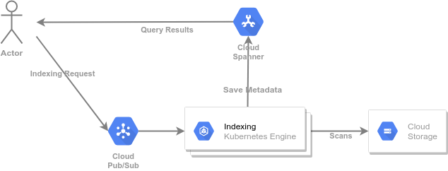

# Getting Started with GKE and C++

This guide builds upon the general [Getting Started with C++] guide.
It deploys the GCS indexing application to [GKE] (Google Kubernetes Engine)
instead of [Cloud Run], taking advantage of the long-running servers in
GKE to improve throughput.

The steps in this guide are self-contained.  It is not necessary to go through
the [Getting Started with C++] guide to go through these steps. It may be
easier to understand the motivation and the main components if you do so.
Note that some commands below may create resources (such as the [Cloud Spanner]
instance and database) that are already created in the previous guide.

## Motivation

A common technique to improve throughput in [Cloud Spanner] is to aggregate
multiple changes into a single transaction, minimizing the synchronization
and networking overheads. However, applications deployed to Cloud Run
cannot assume they will remain running after they respond to a request.  This
makes it difficult to aggregate work from multiple [Pub/Sub][Cloud Pub/Sub]
messages.

In this guide we will modify the application to:

* Run in GKE, where applications are long-lived and can assume they remain
  active after handling a message.
* Connect to Cloud Pub/Sub using [pull subscriptions], which have lower
  overhead and implement a more fine-grained flow control mechanism.
* Use background threads to aggregate the results from multiple Cloud Pub/Sub
  messages into a single Cloud Spanner transaction.

[Getting Started with C++]: ../README.md
[Cloud Build]: https://cloud.google.com/build
[Cloud Monitoring]: https://cloud.google.com/monitoring
[Cloud Run]: https://cloud.google.com/run
[GKE]: https://cloud.google.com/kubernetes-engine
[Cloud Storage]: https://cloud.google.com/storage
[Cloud Cloud SDK]: https://cloud.google.com/sdk
[Cloud Shell]: https://cloud.google.com/shell
[GCS]: https://cloud.google.com/storage
[Cloud Spanner]: https://cloud.google.com/spanner
[Cloud Pub/Sub]: https://cloud.google.com/pubsub
[Container Registry]: https://cloud.google.com/container-registry
[Pricing Calculator]: https://cloud.google.com/products/calculator
[gke-quickstart]: https://cloud.google.com/kubernetes-engine/docs/quickstart
[gcp-quickstarts]: https://cloud.google.com/resource-manager/docs/creating-managing-projects
[buildpacks]: https://buildpacks.io
[docker]: https://docker.com/
[docker-install]: https://store.docker.com/search?type=edition&offering=community
[sudoless docker]: https://docs.docker.com/engine/install/linux-postinstall/
[pack-install]: https://buildpacks.io/docs/install-pack/

## Overview

At a high-level, our plan is to replace "Cloud Run" with "Kubernetes Engine" in the
[Getting Started with C++] application:



For completeness, the following instructions duplicate some of the steps in the
previous guide. We will need to issue a number of commands to create the
GKE cluster, the Cloud Pub/Sub topics and subscriptions, as well as the
Cloud Spanner instance and database. With this application we will need to
create a service account (sometimes called "robot" accounts) to run the
application, and grant this service account the necessary permissions.

## Prerequisites

This example assumes that you have an existing GCP (Google Cloud Platform)
project. The project must have billing enabled, as some of the services used in
this example require it. If needed, consult:

* the [GCP quickstarts][gcp-quickstarts] to setup a GCP project
* the [GKE quickstart][cloud-gke-quickstart] to setup GKE in your project

Use your workstation, a GCE instance, or the [Cloud Shell] to get a
command-line prompt. If needed, login to GCP using:

```sh
gcloud auth login
```

Throughout the example we will use `GOOGLE_CLOUD_PROJECT` as an
environment variable containing the name of the project.

```sh
export GOOGLE_CLOUD_PROJECT=[PROJECT ID]
```

> :warning: this guide uses Cloud Spanner and GKE. These services are billed by
> the hour **even if you stop using them**. The charges can reach the
> **hundreds** or even **thousands** of dollars per month if you configure a
> large Cloud Spanner instance or large GKE cluster. Consult the
> [Pricing Calculator] for details. Please remember to delete any Cloud Spanner
> and GKE resources once you no longer need them.

### Configure the Google Cloud CLI to use your project

We will issue a number of commands using the [Google Cloud SDK], a command-line
tool to interact with Google Cloud services.  Adding the
`--project=$GOOGLE_CLOUD_PROJECT` to each invocation of this tool quickly
becomes tedious, so we start by configuring the default project:

```sh
gcloud config set project $GOOGLE_CLOUD_PROJECT
# Output: Updated property [core/project].
```

### Make sure the necessary services are enabled

Some services are not enabled by default when you create a Google Cloud
Project, so we start by enabling all the services we will need.

```sh
gcloud services enable cloudbuild.googleapis.com
gcloud services enable containerregistry.googleapis.com
gcloud services enable container.googleapis.com
gcloud services enable pubsub.googleapis.com
gcloud services enable spanner.googleapis.com
# Output: nothing if the services are already enabled.
#     for services that are not enabled something like this
#     Operation "operations/...." finished successfully.
```

### Get the code for these examples in your workstation

So far, we have not created any C++ code. It is time to compile and deploy our
application, as we will need the name and URL of the deployment to wire the
remaining resources. First obtain the code:

```sh
git clone https://github.com/GoogleCloudPlatform/cpp-samples
# Output: Cloning into 'cpp-samples'...
#   additional informational messages
```

Change your working directory to this new workspace:

```sh
cd cpp-samples/getting-started
```

### Build Docker images for the sample programs

```sh
gcloud builds submit \
    --async \
    --machine-type=e2-highcpu-32 \
    --config=gke/cloudbuild.yaml
# Output:
#   Creating temporary tarball archive of ... file(s) totalling ... KiB before compression.
#   Uploading tarball of [.] to [gs://....tgz]
#   Created [https://cloudbuild.googleapis.com/v1/projects/....].
#   Logs are available at [...].
```

### Create a Cloud Spanner Instance to host your data

As mentioned above, this guide uses [Cloud Spanner] to store the data. We
create the smallest possible instance. If needed we will scale up the instance,
but this is economical and enough for running small jobs.

> :warning: Creating the Cloud Spanner instance incurs immediate billing costs,
> even if the instance is not used.

```sh
gcloud beta spanner instances create getting-started-cpp \
    --config=regional-us-central1 \
    --processing-units=100 \
    --description="Getting Started with C++"
# Output: Creating instance...done.
```

### Create the Cloud Spanner Database and Table for your data

A Cloud Spanner instance is just the allocation of compute resources for your
databases. Think of them as a virtual set of database servers dedicated to
your databases. Initially these servers have no databases or tables associated
with the resources. We need to create a database and table that will host the
data for this demo:

```sh
gcloud spanner databases create gcs-index \
    --ddl-file=gcs_objects.sql \
    --instance=getting-started-cpp
# Output: Creating database...done.
```

### Create a Cloud Pub/Sub Topic for Indexing Requests

Publishers send messages to Cloud Pub/Sub using a **topic**. These are named,
persistent resources. We need to create one to configure the application.

```sh
gcloud pubsub topics create gke-gcs-indexing
# Output: Created topic [projects/.../topics/gke-gcs-indexing].
```

### Create a Cloud Pub/Sub Subscription for Indexing Requests

Subscribers receive messages from Cloud Pub/Sub using a **subscription**. These
are named, persistent resources. We need to create one to configure the application.

```sh
gcloud pubsub subscriptions create --topic=gke-gcs-indexing gke-gcs-indexing
# Output: Created subscription [projects/.../subscriptions/gke-gcs-indexing].
```

### Create the GKE cluster

We use preemptible nodes (the `--preemptible` flag) because they have lower
cost, and the application can safely restart. We also configure the cluster
to grow as needed. The maximum number of nodes (in this case `64`) should be
set based on your available quota or budget. Note that we enable
[workload identity][workload-identity], the recommended way for GKE-based
applications to consume services in Google Cloud.

[workload-identity]: https://cloud.google.com/kubernetes-engine/docs/how-to/workload-identity

```sh
gcloud container clusters create cpp-samples \
      --region="us-central1" \
      --preemptible \
      --min-nodes=0 \
      --max-nodes=64 \
      --enable-autoscaling \
      --workload-pool="$GOOGLE_CLOUD_PROJECT.svc.id.goog"
# Output: ...
# Creating cluster cpp-samples in us-central1...done
# Created [https://container.googleapis.com/v1/projects/$GOOGLE_CLOUD_PROJECT/zones/us-central1/clusters/cpp-samples].
# To inspect the contents of your cluster, go to: https://console.cloud.google.com/kubernetes/workload_/gcloud/us-central1/cpp-samples?project=$GOOGLE_CLOUD_PROJECT
# kubeconfig entry generated for cpp-samples.
# NAME         LOCATION     MASTER_VERSION   MASTER_IP      MACHINE_TYPE  NODE_VERSION     NUM_NODES  STATUS
# cpp-samples  us-central1  ..............   .....          ............  ....             ..          RUNNING
```

Once created, we configure the `kubectl` credentials to use this cluster:

```sh
gcloud container clusters --region="us-central1" get-credentials cpp-samples
# Output: Fetching cluster endpoint and auth data.
#     kubeconfig entry generated for cpp-samples.
```

### Create a GKE service account

GKE recommends configuring a different [workload-identity] for each
GKE workload, and using this identity to access GCP services. To follow
these guidelines we start by creating a service account in the Kubernetes
Cluster. Note that Kubernetes service accounts are distinct from GCP service
accounts, but can be mapped to them (as we do below).

```sh
kubectl create serviceaccount worker
# Output: serviceaccount/worker created
```

### Grant the GKE service account permissions to impersonate the default GCP compute service account

```sh
PROJECT_NUMBER=$(gcloud projects list \
    --filter="project_id=$GOOGLE_CLOUD_PROJECT" \
    --format="value(project_number)" \
    --limit=1)
gcloud iam service-accounts add-iam-policy-binding \
  "--role=roles/iam.workloadIdentityUser" \
  "--member=serviceAccount:$GOOGLE_CLOUD_PROJECT.svc.id.goog[default/worker]" \
  "$PROJECT_NUMBER-compute@developer.gserviceaccount.com"
# Output: <IAM policy list>
```

### Map the GKE service account to the GCP service account

```sh
kubectl annotate serviceaccount worker \
  iam.gke.io/gcp-service-account="$PROJECT_NUMBER-compute@developer.gserviceaccount.com"
# Output: serviceaccount/worker annotated
```

### Wait for the build to complete

Look at the status of your build using:

```sh
gcloud builds list --ongoing
# Output: the list of running jobs
```

If your build has completed the list will be empty. If you need to wait for
this build to complete (it should take about 15 minutes) use:

```sh
gcloud builds log --stream $(gcloud builds list --ongoing --format="value(id)")
# Output: the output from the build, streamed.
```

### Deploy the Programs to GKE

We can now create a job in GKE. GKE requires its configuration files to be
plain YAML, without variables or any other expansion. We use a small script to
generate this file:

```sh
gke/print-deployment.py --project=$GOOGLE_CLOUD_PROJECT | kubectl apply -f -
# Output: deployment.apps/worker created
```

### Use `gcloud` to send an indexing request

This will request indexing some public data. The prefix contains less than 100
objects:

```sh
gcloud pubsub topics publish gke-gcs-indexing \
    --attribute=bucket=gcp-public-data-landsat,prefix=LC08/01/006/001
# Output: messageIds:
#     - '....'
```

### Querying the data

The data should start appearing in the Cloud Spanner database. We can use the
`gcloud` tool to query this data.

```sh
gcloud spanner databases execute-sql gcs-index --instance=getting-started-cpp \
    --sql="select * from gcs_objects where name like '%.txt' order by size desc limit 10"
# Output: metadata for the 10 largest objects with names finishing in `.txt`
```

## Optional: Scaling Up

> :warning: The following steps will incur significant billing costs. Use the
> [Pricing Calculator] to estimate the costs. If you are uncertain as to these
> costs, skip to the [Cleanup Section](#cleanup).

To scan a larger prefix we will need to scale up the GKE deployment:

```sh
kubectl scale deployment/worker --replicas=128
# Output: deployment.apps/worker scaled
```

GKE has detailed tutorials on how to use Cloud Monitoring metrics, such as the
length of the work queue, to [autoscale a deployment][gke-autoscale-on-metrics].

[gke-autoscale-on-metrics]: https://cloud.google.com/kubernetes-engine/docs/tutorials/autoscaling-metrics#pubsub

We also need to scale up the Cloud Spanner instance. We use a `gcloud` command for this:

```sh
gcloud beta spanner instances update getting-started-cpp --processing-units=3000
# Output: Updating instance...done.
```

We can now index a prefix with a few million objects of objects. In our tests
this completed in a little over an hour.

```sh
gcloud pubsub topics publish gke-gcs-indexing \
    --attribute=bucket=gcp-public-data-landsat,prefix=LC08/01
# Output: messageIds:
#     - '....'
```

You can monitor the work queue using the console:

```sh
google-chrome "https://console.cloud.google.com/cloudpubsub/subscription/detail/indexing-requests-cloud-run-push?project=$GOOGLE_CLOUD_PROJECT"
```

Or count the number of indexed objects:

```sh
gcloud spanner databases execute-sql gcs-index --instance=getting-started-cpp \
    --sql="select count(*) from gcs_objects"
# Output:
#    (Unspecified)    --> the count(*) column name
#    49027797         --> the number of rows in the `gcs_objects` table (the actual number may be different)
```

## Cleanup

> :warning: Do not forget to cleanup your billable resources after going
> through this "Getting Started" guide.

### Remove the GKE cluster

```sh
gcloud container clusters --region=us-central1 delete cpp-samples --quiet
# Output: Deleting cluster cpp-samples...done.
#     Deleted [https://container.googleapis.com/v1/projects/coryan-test/zones/us-central1/clusters/cpp-samples].
```

### Remove the Cloud Spanner Instance

```sh
gcloud spanner databases delete gcs-index --instance=getting-started-cpp --quiet
# Output: none
gcloud spanner instances delete getting-started-cpp --quiet
# Output: none
```

### Remove the Cloud Pub/Sub Subscription

```sh
gcloud pubsub subscriptions delete gke-gcs-indexing --quiet
# Output: Deleted subscription [projects/$GOOGLE_CLOUD_PROJECT/subscriptions/gke-gcs-indexing].
```

### Remove the Cloud Pub/Sub Topic

```sh
gcloud pubsub topics delete gke-gcs-indexing --quiet
# Output: Deleted topic [projects/$GOOGLE_CLOUD_PROJECT/topics/gke-gcs-indexing].
```

### Remove the Container image

```sh
gcloud container images delete gcr.io/$GOOGLE_CLOUD_PROJECT/getting-started-cpp/gke:latest --quiet
# Output: Deleted [gcr.io/$GOOGLE_CLOUD_PROJECT/getting-started-cpp/gke:latest]
# Output: Deleted [gcr.io/$GOOGLE_CLOUD_PROJECT/getting-started-cpp/gke@sha256:....]
```

### Remove the cache for Cloud Build

```sh
for tag in $(gcloud container images list-tags gcr.io/$GOOGLE_CLOUD_PROJECT/getting-started-cpp/ci/cache --format="value(tags)" ); do
  gcloud container images delete gcr.io/$GOOGLE_CLOUD_PROJECT/getting-started-cpp/ci/cache:${tag} --quiet
done
# Output: the output from each delete command
```

## Appendix: using a custom service account

### Create a service account for the GKE workload

The GKE workload will need a GCP service account to access GCP resources. Pick
a name and create the account:

```sh
readonly SA_ID="gcs-index-worker-sa"
readonly SA_NAME="$SA_ID@$GOOGLE_CLOUD_PROJECT.iam.gserviceaccount.com"

gcloud iam service-accounts create "$SA_ID" \
    --description="C++ Samples Service Account"
# Output: Created service account [gcs-index-worker-sa].
```

### Grant this SA permissions for Cloud Pub/Sub

```sh
gcloud projects add-iam-policy-binding "$GOOGLE_CLOUD_PROJECT" \
    --member="serviceAccount:$SA_NAME" \
    --role="roles/pubsub.subscriber"
# Output: <IAM policy list (can be very long)>
gcloud projects add-iam-policy-binding "$GOOGLE_CLOUD_PROJECT" \
    --member="serviceAccount:$SA_NAME" \
    --role="roles/pubsub.publisher"
# Output: <IAM policy list (can be very long)>
```

### Grant this SA permissions to read from any GCS Bucket

```sh
gcloud projects add-iam-policy-binding "$GOOGLE_CLOUD_PROJECT" \
    --member="serviceAccount:$SA_NAME" \
    --role="roles/storage.objectViewer"
# Output: <IAM policy list (can be very long)>
```

### Grant this SA permissions to write into the Spanner Database

```sh
gcloud spanner databases add-iam-policy-binding gcs-index \
    --instance="getting-started-cpp" \
    "--member=serviceAccount:$SA_NAME" \
    "--role=roles/spanner.databaseUser"
# Output: <IAM policy list (can be very long)>
```

### Grant the GKE service account permissions to impersonate the GCP Service Account

```sh
gcloud iam service-accounts add-iam-policy-binding \
  "--role=roles/iam.workloadIdentityUser" \
  "--member=serviceAccount:$GOOGLE_CLOUD_PROJECT.svc.id.goog[default/worker]" \
  "$SA_NAME"
# Output: <IAM policy list>
```

### Map the GKE service account to the GCP service account

```sh
kubectl annotate serviceaccount worker \
  iam.gke.io/gcp-service-account=$SA_NAME
# Output: serviceaccount/worker annotated
```
