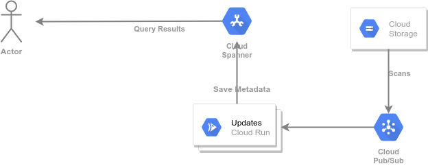

# Getting Started with GCP and C++: background operations

This guide builds upon the general [Getting Started with C++] guide.
It automatically maintains the [GCS (Google Cloud Storage)][GCS] index
described in said guide using an application deployed to [Cloud Run].

The steps in this guide are self-contained.  It is not necessary to go through
the [Getting Started with C++] guide to go through these steps. It may be
easier to understand the motivation and the main components if you do so.
Note that some commands below may create resources (such as the [Cloud Spanner]
instance and database) that are already created in the previous guide.

## Motivation

In the [Getting Started with C++] guide we showed how to build an index for
GCS buckets. We built this index using a work queue to scan the contents of
these buckets. But what if the contents of the bucket change dynamically?
What if other applications insert new objects? Or delete them? Or update the
metadata for an existing objects? We would like to extend the example to
update the index as such changes take place.

[Getting Started with C++]: ../README.md
[Cloud Build]: https://cloud.google.com/build
[Cloud Run]: https://cloud.google.com/run
[Cloud Storage]: https://cloud.google.com/storage
[Cloud Cloud SDK]: https://cloud.google.com/sdk
[Cloud Shell]: https://cloud.google.com/shell
[GCS]: https://cloud.google.com/storage
[Cloud Spanner]: https://cloud.google.com/spanner
[Container Registry]: https://cloud.google.com/container-registry
[Pricing Calculator]: https://cloud.google.com/products/calculator
[cloud-run-quickstarts]: https://cloud.google.com/run/docs/quickstarts
[gcp-quickstarts]: https://cloud.google.com/resource-manager/docs/creating-managing-projects
[buildpacks]: https://buildpacks.io
[docker]: https://docker.com/
[docker-install]: https://store.docker.com/search?type=edition&offering=community
[sudoless docker]: https://docs.docker.com/engine/install/linux-postinstall/
[pack-install]: https://buildpacks.io/docs/install-pack/

## Overview

The basic structure of this application is shown below. We will configure one
or more GCS buckets to send [Pub/Sub notifications] as objects change. A new
application deployed to Cloud Run will receive these notifications, parse them
and update the index accordingly.



[Pub/Sub notifications]: https://cloud.google.com/storage/docs/pubsub-notifications

## Prerequisites

This example assumes that you have an existing GCP (Google Cloud Platform)
project. The project must have billing enabled, as some of the services used in
this example require it. If needed, consult:

* the [GCP quickstarts][gcp-quickstarts] to setup a GCP project
* the [cloud run quickstarts][cloud-run-quickstarts] to setup Cloud Run in your
  project

Use your workstation, a GCE instance, or the [Cloud Shell] to get a
command-line prompt. If needed, login to GCP using:

```sh
gcloud auth login
```

Throughout the example we will use `GOOGLE_CLOUD_PROJECT` as an environment
variable containing the name of the project.

```sh
export GOOGLE_CLOUD_PROJECT=[PROJECT ID]
```

> :warning: this guide uses Cloud Spanner, this service is billed by the hour
> **even if you stop using it**. The charges can reach the **hundreds** or
> **thousands** of dollars per month if you configure a large Cloud Spanner
> instance. Consult the [Pricing Calculator] for details. Please remember to
> delete any Cloud Spanner resources once you no longer need them.

### Configure the Google Cloud CLI to use your project

We will issue a number of commands using the [Google Cloud SDK], a command-line
tool to interact with Google Cloud services.  Adding the
`--project=$GOOGLE_CLOUD_PROJECT` to each invocation of this tool quickly
becomes tedious, so we start by configuring the default project:

```sh
gcloud config set project $GOOGLE_CLOUD_PROJECT
# Output: Updated property [core/project].
```

### Make sure the necessary services are enabled

Some services are not enabled by default when you create a Google Cloud
Project. We enable all the services we will need in this guide using:

```sh
gcloud services enable cloudbuild.googleapis.com
gcloud services enable containerregistry.googleapis.com
gcloud services enable container.googleapis.com
gcloud services enable eventarc.googleapis.com
gcloud services enable pubsub.googleapis.com
gcloud services enable run.googleapis.com
gcloud services enable spanner.googleapis.com
# Output: nothing if the services are already enabled.
# for services that are not enabled something like this
#  Operation "operations/...." finished successfully.
```

### Get the code for these examples in your workstation

So far, we have not created any C++ code. It is time to compile and deploy our
application, as we will need the name and URL of the deployment to wire the
remaining resources. First obtain the code:

```sh
git clone https://github.com/GoogleCloudPlatform/cpp-samples
# Output: Cloning into 'cpp-samples'...
#   additional informational messages
```

### Build Docker images for the sample programs

Change your working directory to the code location:

```sh
cd cpp-samples/getting-started/update
# Output: none
```

Compile the code into a Docker image.  Since we are only planning to build this
example once, we will use [Cloud Build]. Using [Cloud Build] is simpler, but it
does not create a cache of the intermediate build artifacts. Read about
[buildpacks] and the pack tool [install guide][pack-install] to run your builds
locally and cache intermediate artifacts. You can also use [Container Registry]
as a shared cache for buildpacks, both between workstations and for your CI
systems. To learn more about this, consult the buildpack documentation for
[cache images](https://buildpacks.io/docs/app-developer-guide/using-cache-image/).

You can continue with other steps while this build runs in the background.
Optionally, use the links in the output to follow the build process in your
web browser.

```sh
gcloud builds submit \
    --async \
    --machine-type=e2-highcpu-32 \
    --pack image="gcr.io/$GOOGLE_CLOUD_PROJECT/getting-started-cpp/update-gcs-index"
# Output:
#   Creating temporary tarball archive of 10 file(s) totalling 58.1 KiB before compression.
#   Uploading tarball of [.] to [gs://....tgz]
#   Created [https://cloudbuild.googleapis.com/v1/projects/....].
#   Logs are available at [...].
```

### Create a Cloud Spanner Instance to host your data

As mentioned above, this guide uses [Cloud Spanner] to store the data. We
create the smallest possible instance. If needed we will scale up the
instance, but this is economical and enough for running small jobs.

> :warning: Creating the Cloud Spanner instance incurs immediate billing costs,
> even if the instance is not used.

```sh
gcloud beta spanner instances create getting-started-cpp \
    --config=regional-us-central1 \
    --processing-units=100 \
    --description="Getting Started with C++"
# Output: Creating instance...done.
```

### Create the Cloud Spanner Database and Table for your data

A Cloud Spanner instance is just the allocation of compute resources for your
databases. Think of them as a virtual set of database servers dedicated to your
databases. Initially these servers have no databases or tables associated with
the resources. We need to create a database and table that will host the data
for this demo:

```sh
gcloud spanner databases create gcs-index \
    --ddl-file=../gcs_objects.sql \
    --instance=getting-started-cpp
# Output: Creating database...done.
```

### Configurate an Existing Bucket to send Notifications

To use the application we need an existing bucket in your project:

```sh
BUCKET_NAME=... # The name of an existing bucket in your project
```

If you have no buckets in your project, use the [GCS guide] to select a name
and then create the bucket:

```sh
gsutil mb gs://$BUCKET_NAME
```

The `gsutil` tool provides a single command to configure buckets to send
notifications to Cloud Pub/Sub:

```sh
gsutil notifications create \
    -t projects/$GOOGLE_CLOUD_PROJECT/topics/gcs-updates -f json \
    gs://$BUCKET_NAME/
# Output: Created Cloud Pub/Sub topic projects/.../topics/gcs-updates
#    Created notification config projects/_/buckets/$BUCKET_NAME/notificationConfigs/...
```

Note that this will create the topic (if needed), and set the right IAM
permissions enabling GCS to publish on the topic.

[GCS Guide]: https://cloud.google.com/storage/docs/creating-buckets

### Wait for the build to complete

Look at the status of your build using:

```sh
gcloud builds list --ongoing
# Output: the list of running jobs
```

If your build has completed the list will be empty. If you need to wait for
this build to complete (it should take about 15 minutes) use:

```sh
gcloud builds log --stream $(gcloud builds list --ongoing --format="value(id)")
# Output: the output from the build, streamed.
```

### Deploy the Program to Cloud Run

> :warning: To continue, you must wait until the [Cloud Build] build completed.

Once the image is uploaded, we can create a Cloud Run deployment to run it.
This starts up an instance of the job. Cloud Run will scale this up or down as
this needed:

```sh
gcloud run deploy update-gcs-index \
    --image="gcr.io/$GOOGLE_CLOUD_PROJECT/getting-started-cpp/update-gcs-index:latest" \
    --set-env-vars="SPANNER_INSTANCE=getting-started-cpp,SPANNER_DATABASE=gcs-index,TOPIC_ID=gcs-indexing-requests,GOOGLE_CLOUD_PROJECT=$GOOGLE_CLOUD_PROJECT" \
    --region="us-central1" \
    --platform="managed" \
    --no-allow-unauthenticated
# Output: Deploying container to Cloud Run service [update-index-index] in project [....] region [us-central1]
#     Service [gcs-indexing-worker] revision [update-gcs-index-...] has been deployed and is serving 100 percent of traffic.
#     Service URL: https://update-gcs-index-...run.app
```

#### Capture the project number

```sh
PROJECT_NUMBER=$(gcloud projects list \
    --filter="project_id=$GOOGLE_CLOUD_PROJECT" \
    --format="value(project_number)" \
    --limit=1)
# Output: none
```

### Capture the Service URL

We need the URL of this deployment to finish the Cloud Pub/Sub configuration:

```sh
URL="$(gcloud run services describe update-gcs-index \
    --region="us-central1" --format="value(status.url)")"
# Output: none
```

### Create the Cloud Pub/Sub push subscription

Create a push subscription. This sends Cloud Pub/Sub messages as HTTP requests
to the Cloud Run deployment. We use the previously created service account to
make the HTTP request, and allow up to 10 minutes for the request to complete
before Cloud Pub/Sub retries on a different instance.

```sh
gcloud beta eventarc triggers create gcs-updates-trigger \
    --location="us-central1" \
    --destination-run-service="update-gcs-index" \
    --destination-run-region="us-central1" \
    --transport-topic="gcs-updates" \
    --matching-criteria="type=google.cloud.pubsub.topic.v1.messagePublished" \
    --service-account="$PROJECT_NUMBER-compute@developer.gserviceaccount.com"
# Output: Creating trigger [gcs-updates-trigger] in project [$GOOGLE_CLOUD_PROJECT], location [us-central1]...done.
# Publish to Pub/Sub topic [projects/$GOOGLE_CLOUD_PROJECT/topics/gcs-updates] to receive events in Cloud Run service [update-gcs-index].
```

### Use `gsutil` to create a new GCS Object

```sh
echo "The quick brown fox jumps over the lazy dog" | gsutil -q cp - gs://$BUCKET_NAME/fox.txt
# Output: none
```

### Querying the data

The data should start appearing in the Cloud Spanner database. We can use the
`gcloud` tool to query this data.

```sh
gcloud spanner databases execute-sql gcs-index --instance=getting-started-cpp \
    --sql="select * from gcs_objects where name = 'fox.txt' order by updated desc limit 10"
# Output: metadata for the 10 most recent objects named 'fox.txt'
```

Use `gsutil` to create, update, and delete additional objects and run
additional queries.

## Cleanup

> :warning: Do not forget to cleanup your billable resources after going
> through this "Getting Started" guide.

### Remove the Cloud Spanner Instance

```sh
gcloud spanner databases delete gcs-index --instance=getting-started-cpp --quiet
# Output: none
gcloud spanner instances delete getting-started-cpp --quiet
# Output: none
```

### Remove the Cloud Run Deployments

```sh
gcloud run services delete update-gcs-index \
    --region="us-central1" \
    --platform="managed" \
    --quiet
# Output:
#   Deleting [update-gcs-index]...done.
#   Deleted [update-gcs-index].
```

### Remove the Pub/Sub trigger

```sh
gcloud beta eventarc triggers delete gcs-updates-trigger \
    --location="us-central1"
# Output: Deleting trigger [gcs-updates-trigger] in project [$GOOGLE_CLOUD_PROJECT], location [us-central1]...done.
```

### Remove the Cloud Pub/Sub Topic

```sh
gcloud pubsub topics delete gcs-updates --quiet
# Output: Deleted topic [projects/$GOOGLE_CLOUD_PROJECT/topics/gcs-updates].
```

### Remove the Container image

```sh
gcloud container images delete gcr.io/$GOOGLE_CLOUD_PROJECT/getting-started-cpp/update-gcs-index:latest --quiet
# Output: Deleted [gcr.io/$GOOGLE_CLOUD_PROJECT/getting-started-cpp/update-gcs-index:latest]
# Output: Deleted [gcr.io/$GOOGLE_CLOUD_PROJECT/getting-started-cpp/update-gcs-index@sha256:....]
```

### Remove all the notification in the Bucket

```sh
gsutil notifications delete gs://$BUCKET_NAME
# Output: none
```
