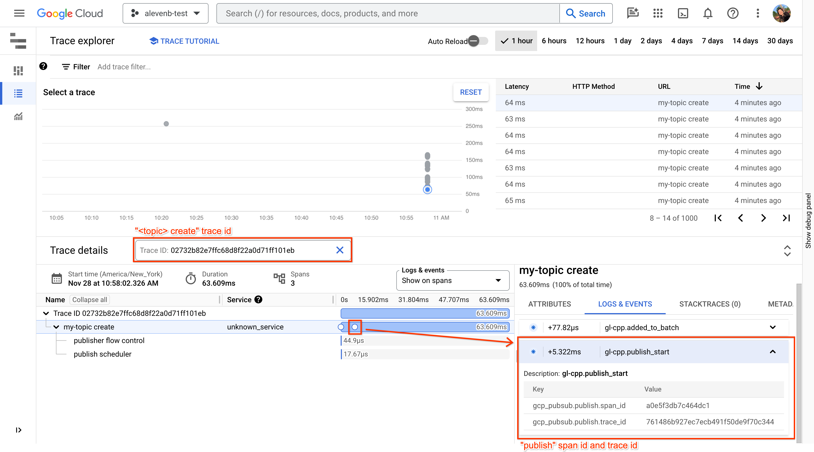

# Enabling Open Telemetry for the Pub/Sub library with Cloud Trace

## Background

In v2.16, we GA'd [OpenTelemetry tracing](https://github.com/googleapis/google-cloud-cpp/releases/tag/v2.16.0). This provides basic instrumentation for all the google-cloud-cpp libraries. 

In v2.19 release[^1], we added instrumentation for the Google Cloud Pub/Sub C++ library on the Publish side. This example provides a basic tracing application that exports spans to Cloud Trace.

[^1]: The [telemetry data](https://github.com/googleapis/google-cloud-cpp/blob/main/doc/public-api.md#telemetry-data) emitted by the google-cloud-cpp library does not follow any versioning guarantees and is subject to change without notice in later versions.

## Overview

### Quickstart
The quickstart creates a tracing enabled Pub/Sub Publisher client that publishes 5 messages and sends the collected traces to Cloud Trace.

#### Example traces

To find the traces, navigate to the Cloud Trace UI.


For an overview of the Cloud Trace UI, see: [View traces overview].

### Publisher

The publisher application lets the user configure a tracing enabled Pub/Sub Publisher client to see how different configuration settings change the produced telemetry data. 

#### Example traces 

To find the traces, navigate to the Cloud Trace UI.

##### Publish trace


##### Create trace



## Prerequisites

### 1. Create a project in the Google Cloud Platform Console 
 
If you haven't already created a project, create one now.

Projects enable you to manage all Google Cloud Platform resources for your app, including deployment, access control, billing, and services.

1. Open the [Cloud Platform Console](https://console.cloud.google.com/).
2. In the drop-down menu at the top, select Create a project.
3. Give your project a name.
4. Make a note of the project ID, which might be different from the project name. The project ID is used in commands and in configurations.

### 2. Enable billing for your project
If you haven't already enabled billing for your
project, [enable billing now](https://console.cloud.google.com/project/_/settings). Enabling billing allows the
application to consume billable resources such as Pub/Sub API calls.

See [Cloud Platform Console Help](https://support.google.com/cloud/answer/6288653) for more information about billing
settings.

### 3. Enable APIs for your project
[Click here](https://console.cloud.google.com/flows/enableapi?apiid=speech&showconfirmation=true) to visit Cloud
Platform Console and enable the Pub/Sub and Trace API via the UI.

Or use the CLI:

```
gcloud services enable trace.googleapis.com 
gcloud services enable pubsub.googleapis.com 
```

### 5. Create the Cloud Pub/Sub topic

```sh
export=GOOGLE_CLOUD_PROJECT=<project-id>
export=GOOGLE_CLOUD_TOPIC=<topic-id>
gcloud pubsub topics create "--project=${GOOGLE_CLOUD_PROJECT}" ${GOOGLE_CLOUD_TOPIC}
```

## Build and run using CMake and Vcpkg
### 1. Install vcpkg
This project uses [`vcpkg`](https://github.com/microsoft/vcpkg) for dependency management. Clone the vcpkg repository
to your preferred location. In these instructions we use`$HOME`:
```shell
git clone -C $HOME https://github.com/microsoft/vcpkg.git
cd $HOME/vcpkg
./vcpkg install google-cloud-cpp
```

### 2. Download or clone this repo

```shell
git clone https://github.com/GoogleCloudPlatform/cpp-samples
```

### 3. Compile these examples

Use the `vcpkg` toolchain file to download and compile dependencies. This file would be in the directory you
cloned `vcpkg` into, `$HOME/vcpkg` if you are following the instructions to the letter. Note that building all the
dependencies can take up to an hour, depending on the performance of your workstation. These dependencies are cached,
so a second build should be substantially faster.
```sh
cd cpp-samples/pubsub-open-telemetry
cmake -S . -B .build -DCMAKE_TOOLCHAIN_FILE=$HOME/vcpkg/scripts/buildsystems/vcpkg.cmake -G Ninja
cmake --build .build
```

### 4. Run the examples

#### Run the quickstart

```shell
.build/quickstart [project-name] [topic-id]
```

#### Run basic publisher examples
```shell
.build/publisher [project-name] [topic-id]
.build/publisher [project-name] [topic-id] -n 1000
.build/publisher [project-name] [topic-id] --message-size 0
.build/publisher [project-name] [topic-id] --tracing-rate 0.01 -n 10
```

#### Flow control example
```shell
.build/publisher [project-name] [topic-id] -n 5 --max-pending-messages 2 --publisher-action reject
.build/publisher [project-name] [topic-id] -n 5 --max-pending-messages 2 --publisher-action block
.build/publisher [project-name] [topic-id] -n 5 --max-pending-messages 2 --publisher-action ignore
.build/publisher [project-name] [topic-id] -n 5 --message-size 10 --max-batch-bytes  60 --publisher-action block
```

#### Batching example
```shell
.build/publisher [project-name] [topic-id] -n 5 --max-batch-messages 2 --max-hold-time 100
.build/publisher [project-name] [topic-id] -n 5 --message-size 10 --max-batch-bytes 60  --max-hold-time 1000
```

#### To see all options

```shell 
.build/publisher --help
Usage: .build/publisher <project-id> <topic-id>
A simple publisher application with Open Telemetery enabled:
  -h [ --help ]                   produce help message
  --project-id arg                the name of the Google Cloud project
  --topic-id arg                  the name of the Google Cloud topic
  --tracing-rate arg (=1)         otel::BasicTracingRateOption value
  --max-queue-size arg (=0)       If set to 0, uses the default tracing 
                                  configuration.
  -n [ --message-count ] arg (=1) the number of messages to publish
  --message-size arg (=1)         the desired message payload size
  --enable-ordering-keys arg (=0) If set to true, the messages will be sent 
                                  with ordering keys. There will be 3 possible 
                                  ordering keys and they will be set randomly
  --max-pending-messages arg      pubsub::MaxPendingMessagesOption value
  --max-pending-bytes arg         pubsub::MaxPendingBytesOption value
  --publisher-action arg          pubsub::FullPublisherAction value 
                                  (block|ignore|reject)
  --max-hold-time arg             pubsub::MaxHoldTimeOption value in us
  --max-batch-bytes arg           pubsub::MaxBatchBytesOption value
  --max-batch-messages arg        pubsub::MaxBatchMessagesOption value
```

## Build and run using Bazel

### 1. Download or clone this repo

```shell
git clone https://github.com/GoogleCloudPlatform/cpp-samples
```

### 2. Compile these examples

```shell
cd cpp-samples/pubsub-open-telemetry
bazel build //:quickstart
```

### 3. Run these examples

#### Run the quickstart
```shell
bazel run //:quickstart [project-name] [topic-id]
```

#### Run basic publisher examples
```shell
bazel run //:publisher [project-name] [topic-id]
bazel run //:publisher -- [project-name] [topic-id] -n 1000
bazel run //:publisher -- [project-name] [topic-id] --message_size 0
bazel run //:publisher -- [project-name] [topic-id] --tracing-rate 0.01 -n 10
```

#### Run with a local version of google-cloud-cpp

```shell
bazel run //:quickstart --override_repository=google_cloud_cpp=$HOME/your-path-to-the-repo/google-cloud-cpp -- [project-name] [topic-id] 
```

## Cleanup

```shell
gcloud pubsub topics delete "--project=${GOOGLE_CLOUD_PROJECT}" ${GOOGLE_CLOUD_TOPIC}
```

## Platform Specific Notes

### macOS

gRPC [requires][grpc-roots-pem-bug] an environment variable to configure the
trust store for SSL certificates, you can download and configure this using:

```bash
curl -Lo roots.pem https://pki.google.com/roots.pem
export GRPC_DEFAULT_SSL_ROOTS_FILE_PATH="$PWD/roots.pem"
```

### Windows

gRPC [requires][grpc-roots-pem-bug] an environment variable to configure the
trust store for SSL certificates, you can download and configure this using:

```console
@powershell -NoProfile -ExecutionPolicy unrestricted -Command ^
    (new-object System.Net.WebClient).Downloadfile( ^
        'https://pki.google.com/roots.pem', 'roots.pem')
set GRPC_DEFAULT_SSL_ROOTS_FILE_PATH=%cd%\roots.pem
```

[grpc-roots-pem-bug]: https://github.com/grpc/grpc/issues/16571
[choco-cmake-link]: https://chocolatey.org/packages/cmake
[homebrew-cmake-link]: https://formulae.brew.sh/formula/cmake
[cmake-download-link]: https://cmake.org/download/
[view traces overview]: https://cloud.google.com/trace/docs/trace-overview