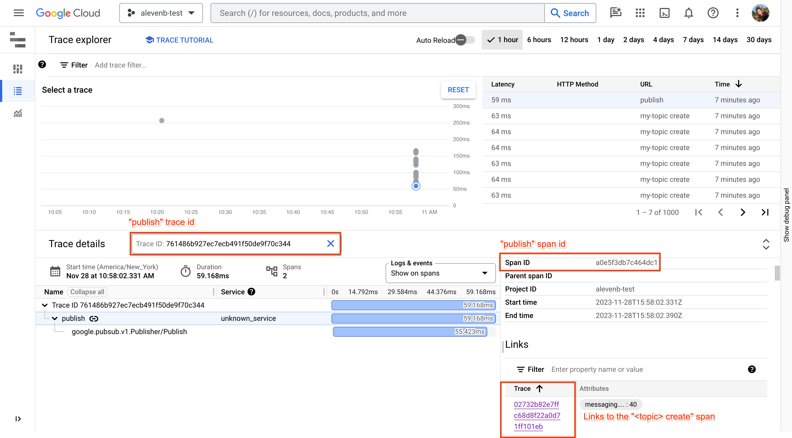
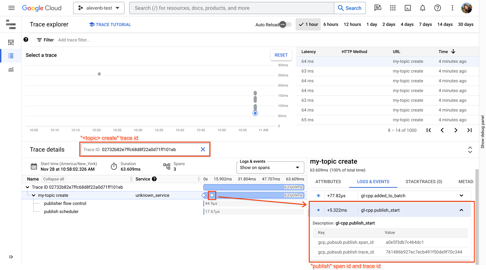
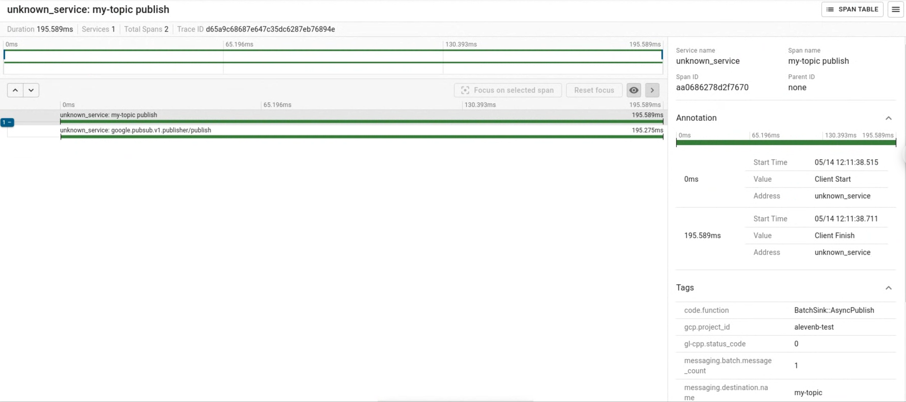
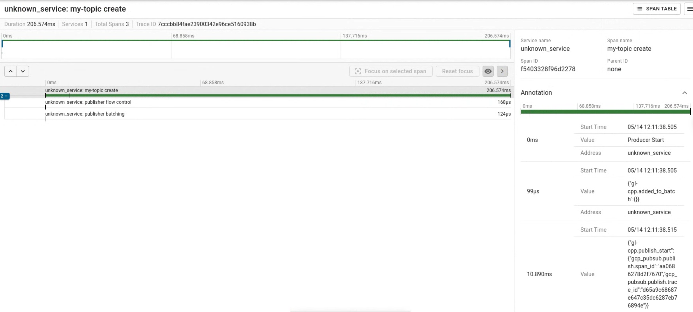

# Publisher

The publisher application lets the user configure a tracing enabled Pub/Sub
Publisher client to see how different configuration settings change the produced
telemetry data.

For setup instructions, refer to the [README.md](README.md).

## Cloud Trace

### Example traces

To find the traces, navigate to the Cloud Trace UI.

#### Publish trace



#### Create trace



## Build and run

### Using CMake and Vcpkg

#### Run basic publisher examples

```shell
.build/publisher [project-name] [topic-id]
.build/publisher [project-name] [topic-id] -n 1000
.build/publisher [project-name] [topic-id] --tracing-rate 0.01 -n 10
```

#### Flow control example

```shell
.build/publisher [project-name] [topic-id] -n 5 --max-pending-messages 2 --publisher-action reject
.build/publisher [project-name] [topic-id] -n 5 --max-pending-messages 2 --publisher-action block
.build/publisher [project-name] [topic-id] -n 5 --max-pending-messages 2 --publisher-action ignore
.build/publisher [project-name] [topic-id] -n 5 --message-size 10 --max-batch-bytes  60 --publisher-action block
```

#### Batching example

```shell
.build/publisher [project-name] [topic-id] -n 5 --max-batch-messages 2 --max-hold-time 100
.build/publisher [project-name] [topic-id] -n 5 --message-size 10 --max-batch-bytes 60  --max-hold-time 1000
```

#### To see all options

```shell
.build/publisher --help
Usage: .build/publisher <project-id> <topic-id>
A simple publisher application with Open Telemetery enabled:
  -h [ --help ]                   produce help message
  --project-id arg                the name of the Google Cloud project
  --topic-id arg                  the name of the Google Cloud topic
  --tracing-rate arg (=1)         otel::BasicTracingRateOption value
  --max-queue-size arg (=2048)    set the max queue size for open telemetery
  -n [ --message-count ] arg (=1) the number of messages to publish
  --message-size arg (=1)         the desired message payload size
  --max-pending-messages arg      pubsub::MaxPendingMessagesOption value
  --max-pending-bytes arg         pubsub::MaxPendingBytesOption value
  --publisher-action arg          pubsub::FullPublisherAction value
                                  (block|ignore|reject)
  --max-hold-time arg             pubsub::MaxHoldTimeOption value in us
  --max-batch-bytes arg           pubsub::MaxBatchBytesOption value
  --max-batch-messages arg        pubsub::MaxBatchMessagesOption value
```

## Zipkin

Zipkin exporter is only supported by CMake at the moment.

### Setup

If you do not already, have one create a local Zipkin instance.

#### (optional) Create a local Zipkin instance.

To run Zipkin on the host `http://localhost:9411`

```shell
docker run -d -p 9411:9411 openzipkin/zipkin
```

To kill the instance

```shell
docker container ls
docker rm -f openzipkin/zipkin
```

<!-- TODO(issues/285): when the library in vcpkg is updated, add the screenshots
#### Publish trace



#### Create trace

 -->

## Build and run

### Using CMake and Vcpkg

#### Run the publisher with Zipkin

```sh
cd cpp-samples/pubsub-open-telemetry
cmake -DWITH_ZIPKIN=ON -S . -B .build -DCMAKE_TOOLCHAIN_FILE=$HOME/vcpkg/scripts/buildsystems/vcpkg.cmake -G Ninja
cmake --build .build
```

#### Run basic publisher examples

```shell
.build/publisher_zipkin [project-name] [topic-id]
.build/publisher_zipkin [project-name] [topic-id] -n 1000
.build/publisher_zipkin [project-name] [topic-id] --tracing-rate 0.01 -n 10
```
