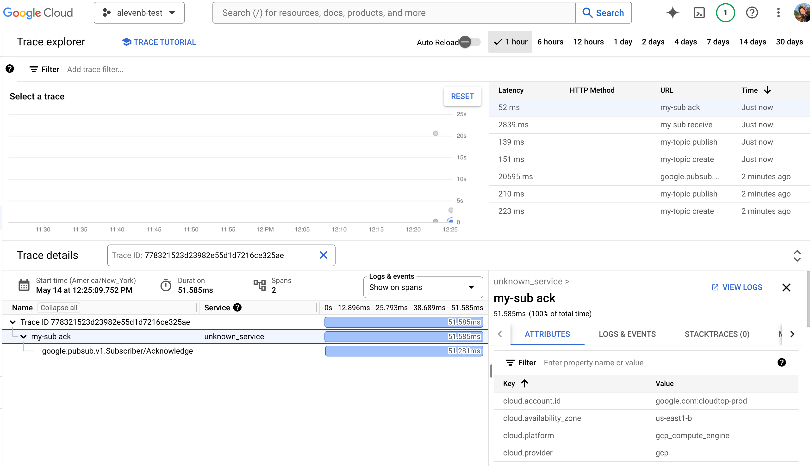

# Subscriber

To try receiving a message using unary pull, run the `unary_pull_subscriber`
application. It publishes a message to a topic and then pulls the same message
from a subscription, and then exports the spans to cloud trace.

**Note**: OTel ABI 2.0 adds the ability to add links after span creation. If an
application is compiled with OTel ABI 2.0, it will produce different telemetery
data. We currently do not support OTel ABI 2.0 with CMake.

For setup instructions, refer to the [README.md](README.md).

## Example traces

To find the traces, navigate to the Cloud Trace UI.

#### With OTel ABI 1.0

#### Receive trace


#### Ack trace



#### With OTel ABI 2.0

#### Receive trace


#### Ack trace


### Setup

### Create the Cloud Pub/Sub subscription attached to a topic

If you don't already have them, create a topic and a subscription with pull
delivery.

Export the following environment variables:

```sh
export=GOOGLE_CLOUD_PROJECT=[PROJECT-ID]
export=GOOGLE_CLOUD_SUBSCRIPTION=[SUBSCRIPTION-ID]
export=GOOGLE_CLOUD_TOPIC=[TOPIC-ID]
```

Use the CLI to create the resources:

```sh
gcloud pubsub topics create "--project=${GOOGLE_CLOUD_PROJECT}" ${GOOGLE_CLOUD_TOPIC}
gcloud pubsub subscriptions create "--project=${GOOGLE_CLOUD_PROJECT}" "--topic=${GOOGLE_CLOUD_TOPIC}" ${GOOGLE_CLOUD_SUBSCRIPTION}
```

### Publish a message

Make sure you publish a message with tracing enabled. If not, the traces will
not be linked.

## Build and run

### Using CMake and Vcpkg

```sh
cd cpp-samples/pubsub-open-telemetry
cmake -S . -B .build -DCMAKE_TOOLCHAIN_FILE=$HOME/vcpkg/scripts/buildsystems/vcpkg.cmake -G Ninja
cmake --build .build --target unary_pull_subscriber
```

#### Run the subscriber with the unary pull

```shell
.build/unary_pull_subscriber ${GOOGLE_CLOUD_PROJECT} ${GOOGLE_CLOUD_TOPIC} ${GOOGLE_CLOUD_SUBSCRIPTION}
```

## Build and run using Bazel

### 1. Download or clone this repo

```shell
git clone https://github.com/GoogleCloudPlatform/cpp-samples
```

### 2. Compile and run these examples

```shell
cd cpp-samples/pubsub-open-telemetry
bazel run //:unary_pull_subscriber -- ${GOOGLE_CLOUD_PROJECT} ${GOOGLE_CLOUD_TOPIC} ${GOOGLE_CLOUD_SUBSCRIPTION}
```

#### Run the example with otel ABI 2.0

```shell
bazel run --config=otel2 //:unary_pull_subscriber -- ${GOOGLE_CLOUD_PROJECT} ${GOOGLE_CLOUD_TOPIC} ${GOOGLE_CLOUD_SUBSCRIPTION}
```
